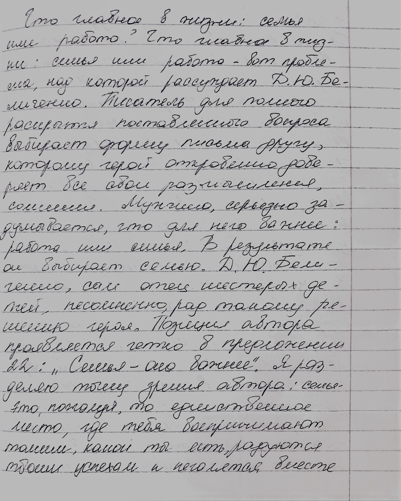

# Метод атрибуции автора рукописного текста на основе интерпретируемых признаков почерка и ансамблевых моделей машинного обучения

Разработка и исследование метода атрибуции автора офлайн-рукописного текста на основе интерпретируемых морфометрических признаков почерка и ансамблевых моделей машинного обучения

## Структура проекта
* src  - исходный код проекта
* data - данные для обучения модели
    * сканы почерка каждого автора находятся в отдельной папке
* docs - документация по модулям/данным/компонентам и т.д.

## Источники данных 

Данные идут с дата сета [HWR200](https://huggingface.co/datasets/AntiplagiatCompany/HWR200). HWR200 содержит изображения рукописных текстов на русском языке от 200 разных авторов, сфотографированных в разных условиях

## Примеры данных 

## Контактные данные

* Telegram: @FedyaPetT
* VK: https://vk.ru/petfedya123